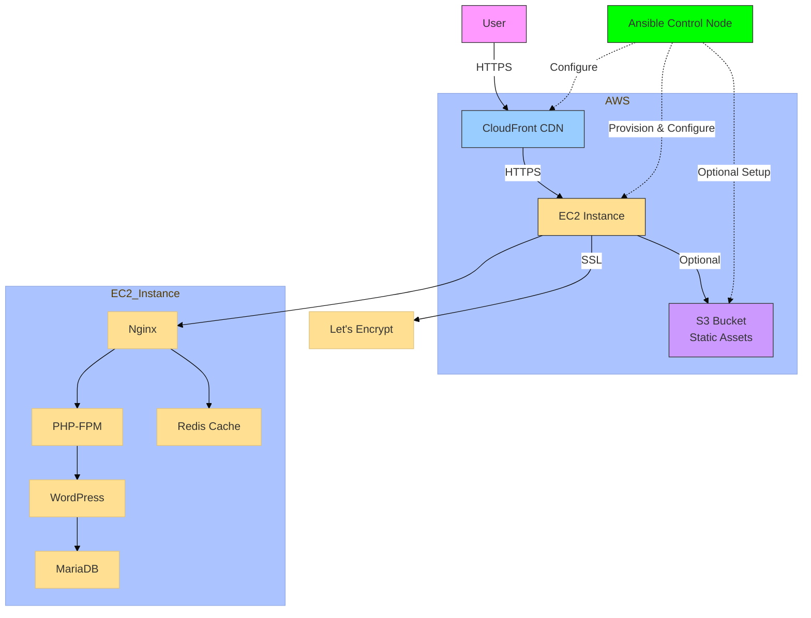

# WordPress on AWS with Ansible Deployment

This project automates the deployment of a high-performance WordPress site on AWS infrastructure using Ansible. The setup includes Nginx, CloudFront CDN, Let's Encrypt SSL, Redis caching, and optional S3 integration for static assets.

## Features

- **Complete Infrastructure Provisioning**: EC2 instance with proper security groups
- **Optimized Web Server**: Nginx configured for high performance
- **Global Content Delivery**: CloudFront CDN integration
- **Free SSL Certificates**: Automated Let's Encrypt certificate management
- **Object Caching**: Redis for improved WordPress performance
- **Static Assets Optimization**: Optional S3 bucket for media files
- **Automated Deployment**: Fully reproducible infrastructure as code

## Prerequisites

Before using this playbook, ensure you have:

1. **Ansible** installed on your control machine (version 2.9+ recommended)
   ```bash
   pip install ansible
   ```

2. **AWS Account** with proper IAM permissions:
   - EC2 full access
   - CloudFront full access
   - S3 full access (if using static assets)
   - Route53 access (if using DNS validation)

3. **AWS CLI** configured with credentials:
   ```bash
   aws configure
   ```

4. **Required Ansible Collections**:
   ```bash
   ansible-galaxy collection install amazon.aws community.mysql community.general
   ```

## Architecture Overview

 


1. **AWS EC2 Instance**: Ubuntu 20.04 LTS server running:
   - Nginx web server
   - PHP-FPM
   - MariaDB database
   - Redis server

2. **CloudFront CDN**: Global content delivery with:
   - HTTPS encryption
   - Edge caching
   - DDoS protection

3. **Let's Encrypt**: Automated SSL certificate management

4. **Optional S3 Bucket**: For static assets offloading

## Directory Structure

```
wordpress-aws/
├── inventory/
│   └── hosts.ini            # Inventory file (dynamically populated)
├── group_vars/
│   └── all.yml              # All variables for the deployment
├── roles/
│   ├── ec2_provision/       # EC2 instance provisioning
│   ├── nginx_setup/         # Nginx web server configuration
│   ├── wordpress_setup/     # WordPress installation
│   ├── cloudfront_setup/    # CloudFront CDN configuration
│   ├── letsencrypt/         # SSL certificate management
│   ├── redis/               # Redis caching setup
│   └── s3_setup/            # S3 static assets (optional)
└── site.yml                 # Main playbook
```

## Configuration

Edit the following files to customize your deployment:

1. **`group_vars/all.yml`**: Main configuration file with all variables
   - AWS credentials and region
   - Instance type and AMI
   - WordPress database credentials
   - CloudFront settings
   - Let's Encrypt email and domains
   - Redis configuration

2. **`roles/*/defaults/main.yml`**: Role-specific default variables

## Deployment Steps

1. Clone this repository:
   ```bash
   git clone https://github.com/your-repo/wordpress-aws.git
   cd wordpress-aws
   ```

2. Configure your variables in `group_vars/all.yml`

3. Run the playbook:
   ```bash
   ansible-playbook -i inventory/hosts.ini site.yml
   ```

4. The playbook will:
   - Provision EC2 instance
   - Install and configure Nginx, PHP, MariaDB
   - Set up WordPress
   - Configure CloudFront CDN
   - Install Let's Encrypt SSL certificates
   - Set up Redis caching
   - (Optional) Configure S3 for static assets

## Post-Deployment

After successful deployment:

1. **Access WordPress Admin**:
   - URL: `https://your-domain.com/wp-admin/`
   - Credentials: Displayed at the end of the playbook run

2. **Verify Services**:
   - Check Nginx: `systemctl status nginx`
   - Check PHP-FPM: `systemctl status php7.4-fpm`
   - Check Redis: `redis-cli ping` (should return "PONG")

3. **Recommended WordPress Plugins**:
   - Redis Object Cache (already installed)
   - WP Super Cache or W3 Total Cache
   - S3 Uploads (if using S3 for media)

## Maintenance

### Certificate Renewal
Let's Encrypt certificates are automatically renewed via cron job. To manually renew:
```bash
certbot renew --dry-run
```

### Redis Monitoring
Check Redis memory usage:
```bash
redis-cli info memory
```

### CloudFront Cache Invalidation
Create cache invalidation when content changes:
```bash
aws cloudfront create-invalidation --distribution-id YOUR_DIST_ID --paths "/*"
```

## Security Best Practices

1. **Regular Updates**:
   ```bash
   sudo apt update && sudo apt upgrade -y
   ```

2. **Firewall Rules**:
   - Restrict SSH access to your IP
   - Allow only CloudFront IPs to access your origin

3. **Backups**:
   - Set up automated backups for:
     - WordPress files (`/var/www/wordpress`)
     - Database (use `mysqldump`)
     - Redis data (if persistent)

4. **Monitoring**:
   - Set up CloudWatch alarms
   - Enable access logs for Nginx and CloudFront

## Troubleshooting

### Common Issues

1. **Let's Encrypt Certificate Failure**:
   - Verify domain points to your CloudFront distribution
   - Check DNS propagation
   - Ensure port 80 is open during certificate issuance

2. **Redis Connection Issues**:
   - Verify Redis is running: `systemctl status redis-server`
   - Check WordPress Redis plugin settings

3. **CloudFront Errors**:
   - Verify origin server is accessible
   - Check security group rules
   - Validate cache behaviors

### Log Files

- Nginx access logs: `/var/log/nginx/wordpress.access.log`
- Nginx error logs: `/var/log/nginx/wordpress.error.log`
- PHP-FPM logs: `/var/log/php7.4-fpm.log`
- Redis logs: `/var/log/redis/redis-server.log`
- Certbot logs: `/var/log/letsencrypt/`

## Customization Options

1. **Multi-Site Setup**:
   - Add `define('WP_ALLOW_MULTISITE', true);` to wp-config.php
   - Configure Nginx for multisite

2. **Additional Security**:
   - Implement AWS WAF for CloudFront
   - Set up fail2ban for SSH protection
   - Configure ModSecurity for Nginx

3. **High Availability**:
   - Add multiple EC2 instances behind an ALB
   - Set up RDS for database
   - Configure Elasticache for Redis

## License

This project is licensed under the MIT License - see the [LICENSE](LICENSE) file for details.

## Acknowledgments

- AWS for cloud infrastructure
- Ansible for configuration management
- Let's Encrypt for free SSL certificates
- WordPress and open source community

---

For support or contributions, please open an issue on GitHub or submit a pull request.